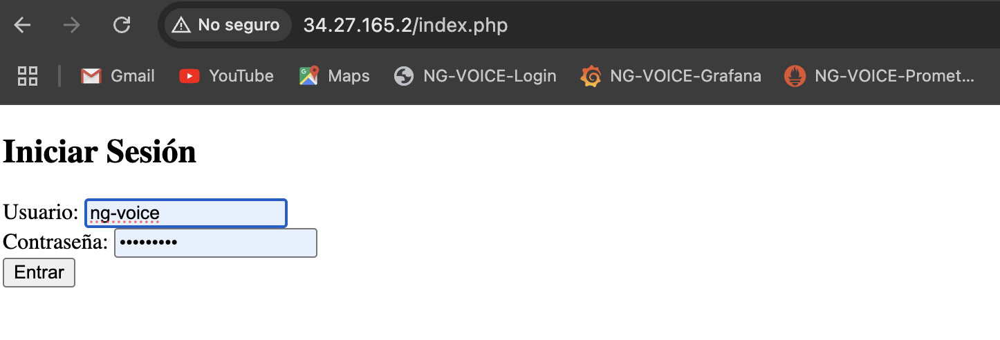
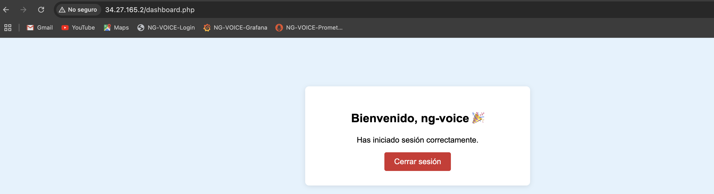
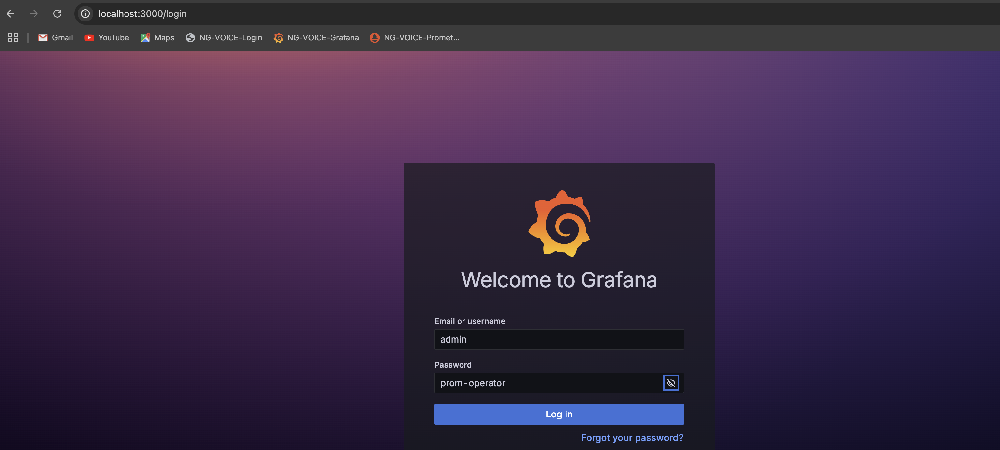
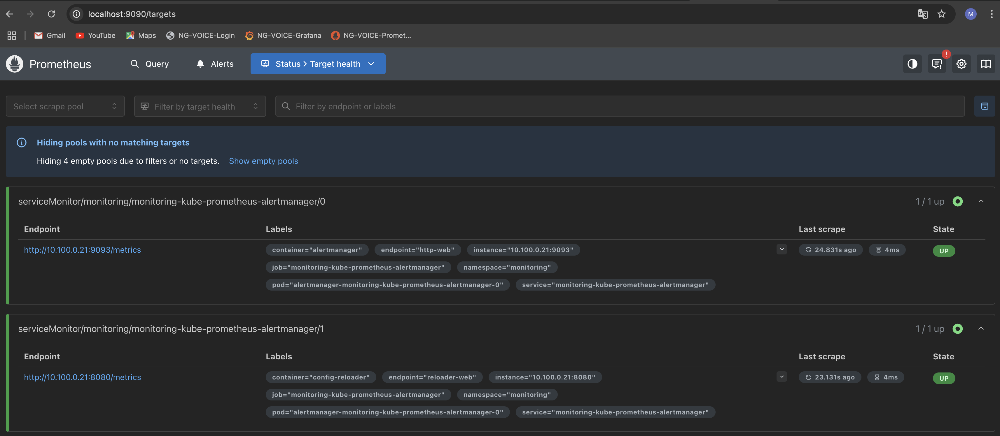

# K8s Challenge
#### El siguiente repositorio contiene un despliegue básico de una aplicación web en un cluster de kubernetes, usando herramientas de Google Cloud Platform (GCP) como GKE y Cloud SQL, además de monitoreo de infraestructura con Prometheus y Grafana. 

### ⚙️ Premisas y Requisitos para Ejecutar el Proyecto

#### ✅ 1. Requisitos de cuentas y servicios en la nube

#### 1.1 Google Cloud Platform (GCP)

- Cuenta activa en Google Cloud con facturación habilitada.
- Proyecto creado en GCP.
- Habilitar las siguientes API´s en el proyecto de GCP:
- Kubernetes Engine API
  - Cloud SQL Admin API
  - Compute Engine API
  - Artifact Registry


- Comandos para habilitar API´s en el proyecto de GCP:
```
gcloud services enable container.googleapis.com
gcloud services enable sqladmin.googleapis.com
gcloud services enable compute.googleapis.com
gcloud services enable containerregistry.googleapis.com
```

---

#### ✅ 2. Recursos necearios en equipo local (MacOS)

#### 2.1 Software necesario:
| Herramienta      | Propósito                             | Comando sugerido o enlace                    |
|------------------|----------------------------------------|----------------------------------------------|
| Docker           | Construcción local de imágenes         | [docker.com](https://www.docker.com)         |
| gcloud CLI       | Interacción con GCP                    | `brew install --cask google-cloud-sdk`       |
| kubectl          | Gestión de recursos de GKE             | `gcloud components install kubectl`          |
| mysql-client     | Conexión a base de datos Cloud SQL     | `brew install mysql-client`                  |
| helm             | Instalación de Prometheus y Grafana    | `brew install helm`                          |


2.2 Instalación y validación de "gcloud CLI"
```
brew install --cask google-cloud-sdk
gcloud init
gcloud auth login
gcloud version
```
```
acoca@K8s gke-challenge % gcloud version                   
Google Cloud SDK 533.0.0
```
2.3 Instalación y validación de "kubectl"
```
gcloud components install kubectl
```
```
acoca@K8s gke-challenge % kubectl version
Client Version: v1.33.3
Kustomize Version: v5.6.0
Server Version: v1.33.2-gke.1240000
```
2.4 Instalación y validación de "mysql-client"

```
brew install mysql-client
brew list mysql-client
```
```
acoca@K8s gke-challenge % brew list mysql-client
/opt/homebrew/Cellar/mysql-client/9.4.0/bin/comp_err
/opt/homebrew/Cellar/mysql-client/9.4.0/bin/my_print_defaults
/opt/homebrew/Cellar/mysql-client/9.4.0/bin/mysql
/opt/homebrew/Cellar/mysql-client/9.4.0/bin/mysql_config
/opt/homebrew/Cellar/mysql-client/9.4.0/bin/mysql_config_editor
/opt/homebrew/Cellar/mysql-client/9.4.0/bin/mysql_migrate_keyring
/opt/homebrew/Cellar/mysql-client/9.4.0/bin/mysql_secure_installation
/opt/homebrew/Cellar/mysql-client/9.4.0/bin/mysqladmin
/opt/homebrew/Cellar/mysql-client/9.4.0/bin/mysqlbinlog
/opt/homebrew/Cellar/mysql-client/9.4.0/bin/mysqlcheck
/opt/homebrew/Cellar/mysql-client/9.4.0/bin/mysqldump
/opt/homebrew/Cellar/mysql-client/9.4.0/bin/mysqlimport
/opt/homebrew/Cellar/mysql-client/9.4.0/bin/mysqlshow
/opt/homebrew/Cellar/mysql-client/9.4.0/bin/mysqlslap
/opt/homebrew/Cellar/mysql-client/9.4.0/bin/mysqltest
/opt/homebrew/Cellar/mysql-client/9.4.0/bin/perror
/opt/homebrew/Cellar/mysql-client/9.4.0/include/mysql/ (13 files)
/opt/homebrew/Cellar/mysql-client/9.4.0/lib/libmysqlclient.24.dylib
/opt/homebrew/Cellar/mysql-client/9.4.0/lib/pkgconfig/mysqlclient.pc
/opt/homebrew/Cellar/mysql-client/9.4.0/lib/plugin/ (5 files)
/opt/homebrew/Cellar/mysql-client/9.4.0/lib/ (2 other files)
/opt/homebrew/Cellar/mysql-client/9.4.0/sbom.spdx.json
/opt/homebrew/Cellar/mysql-client/9.4.0/share/doc/ (2 files)
/opt/homebrew/Cellar/mysql-client/9.4.0/share/man/ (27 files)
/opt/homebrew/Cellar/mysql-client/9.4.0/share/mysql/ (53 files)
```
2.5 Instalación y validación de "Helm"

```
brew install helm
helm version
```
```
acoca@K8s gke-challenge % helm version
version.BuildInfo{Version:"v3.18.4", GitCommit:"d80839cf37d860c8aa9a0503fe463278f26cd5e2", GitTreeState:"clean", GoVersion:"go1.24.5"}
```
2.6 Validación de instalación de Docker
```
docker version
```
```
acoca@K8s gke-challenge % docker version
Client:
 Version:           28.3.2
 API version:       1.51
 Go version:        go1.24.5
 Git commit:        578ccf6
 Built:             Wed Jul  9 16:12:57 2025
 OS/Arch:           darwin/arm64
 Context:           desktop-linux

Server: Docker Desktop 4.43.2 (199162)
 Engine:
  Version:          28.3.2
  API version:      1.51 (minimum version 1.24)
  Go version:       go1.24.5
  Git commit:       e77ff99
  Built:            Wed Jul  9 16:13:56 2025
  OS/Arch:          linux/arm64
  Experimental:     false
 containerd:
  Version:          1.7.27
  GitCommit:        05044ec0a9a75232cad458027ca83437aae3f4da
 runc:
  Version:          1.2.5
  GitCommit:        v1.2.5-0-g59923ef
 docker-init:
  Version:          0.19.0
  GitCommit:        de40ad0
  ````


---

#### ✅ 3. Recursos necesarios en GCP

3.1 Creacion de proyecto en GCP
```
gcloud projects create  gke-challenge-msl
```
```
acoca@K8s gke-challenge % gcloud projects  create gke-challenge-msl
Create in progress for [https://cloudresourcemanager.googleapis.com/v1/projects/gke-challenge-msl].
Waiting for [operations/create_project.global.9159840548868572380] to finish...done.                                                                                     
Enabling service [cloudapis.googleapis.com] on project [gke-challenge-msl]...
Operation "operations/acat.p2-669243478909-a6a7bd30-c97c-4786-9917-5c5d39b46e27" finished successfully.
```
3.1.1 Validar y habilitar cuenta de facuración al proyecto de GCP
```
cloud alpha billing accounts list
```
```
acoca@K8s gke-challenge % gcloud alpha billing accounts list
|ACCOUNT_ID            |NAME                      |OPEN  MASTER_ACCOUNT_ID|
|----------------------|--------------------------|-----------------------|
|0144E4-4F81E0-26C456  |Mi cuenta de facturación  |True                   |
```
```
gcloud beta billing projects link gke-challenge-msl  --billing-account=0144E4-4F81E0-26C456 
````

```
acoca@K8s gke-challenge %     gcloud beta billing projects link gke-challenge-msl  --billing-account=0144E4-4F81E0-26C456 
billingAccountName: billingAccounts/0144E4-4F81E0-26C456
billingEnabled: true
name: projects/gke-challenge-msl/billingInfo
projectId: gke-challenge-msl
```

3.2 Habilitar API en el proyecto de GCP

3.2.1 Validar nombre de proyecto en uso
```
gcloud config get-value project
gcloud config set project gke-challenge-msl 
```
```
acoca@K8s gke-challenge % gcloud config get-value project 
(unset)
acoca@K8s gke-challenge % gcloud config set project gke-challenge-msl
Updated property [core/project].
acoca@K8s gke-challenge % gcloud config get-value project        
gke-challenge-msl
```
3.2.2 Comandos para habilitar API´s en el proyecto de GCP 

```
gcloud services enable container.googleapis.com
gcloud services enable sqladmin.googleapis.com
gcloud services enable compute.googleapis.com
gcloud services enable containerregistry.googleapis.com
gcloud services enable artifactregistry.googleapis.com
```
```
acoca@K8s gke-challenge % gcloud services list
NAME                                TITLE
analyticshub.googleapis.com         Analytics Hub API
artifactregistry.googleapis.com     Artifact Registry API
autoscaling.googleapis.com          Cloud Autoscaling API
bigquery.googleapis.com             BigQuery API
bigqueryconnection.googleapis.com   BigQuery Connection API
bigquerydatapolicy.googleapis.com   BigQuery Data Policy API
bigquerymigration.googleapis.com    BigQuery Migration API
bigqueryreservation.googleapis.com  BigQuery Reservation API
bigquerystorage.googleapis.com      BigQuery Storage API
cloudapis.googleapis.com            Google Cloud APIs
cloudtrace.googleapis.com           Cloud Trace API
compute.googleapis.com              Compute Engine API
container.googleapis.com            Kubernetes Engine API
containerfilesystem.googleapis.com  Container File System API
containerregistry.googleapis.com    Container Registry API
dataform.googleapis.com             Dataform API
dataplex.googleapis.com             Cloud Dataplex API
datastore.googleapis.com            Cloud Datastore API
dns.googleapis.com                  Cloud DNS API
gkebackup.googleapis.com            Backup for GKE API
iam.googleapis.com                  Identity and Access Management (IAM) API
iamcredentials.googleapis.com       IAM Service Account Credentials API
logging.googleapis.com              Cloud Logging API
monitoring.googleapis.com           Cloud Monitoring API
networkconnectivity.googleapis.com  Network Connectivity API
oslogin.googleapis.com              Cloud OS Login API
pubsub.googleapis.com               Cloud Pub/Sub API
servicemanagement.googleapis.com    Service Management API
serviceusage.googleapis.com         Service Usage API
sql-component.googleapis.com        Cloud SQL
sqladmin.googleapis.com             Cloud SQL Admin API
storage-api.googleapis.com          Google Cloud Storage JSON API
storage-component.googleapis.com    Cloud Storage
storage.googleapis.com              Cloud Storage API
acoca@K8s gke-challenge % 
```
3.3 Creación de repositorio artifact registry en GCP 
```
gcloud artifacts repositories create gke-challenge-msl \
  --repository-format=docker \
  --location=us-central1 \
  --description="gke-challenge-msl" 
  ```
  ```
  acoca@K8s gke-challenge % gcloud artifacts repositories create gke-challenge-msl \
  --repository-format=docker \
  --location=us-central1 \
  --description="gke-challenge-msl"
Create request issued for: [gke-challenge-msl]
Waiting for operation [projects/gke-challenge-msl/locations/us-central1/operations/0e558e2e-41ab-4ab5-a41d-021443b67331] to complete...done.                             
Created repository [gke-challenge-msl].
```
```
3.4 Creación de cluster GKE en GCP
```
gcloud container clusters create gke-challenge-msl \
  --zone us-central1-a \
  --num-nodes 1

  gcloud container clusters list 
  ```
  ```
acoca@K8s gke-challenge % gcloud container clusters list                                                
|NAME             |LOCATION     |MASTER_VERSION    |MASTER_IP     |MACHINE_TYPE|NODE_VERSION       |NUM_NODES  |STATUS   |STACK_TYPE|
|gke-challenge-msl|us-central1-a|1.33.2-gke.1240000|35.192.113.196|e2-medium   |1.33.2-gke.1240000 |1          |RUNNING  1IPV4      |
``
3.5 Creación de instancia MySQL en Cloud SQL:
```
gcloud sql instances create gke-challenge-msl \
    --database-version=MYSQL_8_0 \
    --region=us-central1 \
    --tier=db-g1-small \
    --storage-type=SSD \
    --storage-size=10GB
gcloud sql instances describe gke-challenge-msl
```
```
Creating Cloud SQL instance for MYSQL_8_0...done.                                                                                                        
Created [https://sqladmin.googleapis.com/sql/v1beta4/projects/gke-challenge-msl/instances/gke-challenge-msl].
|NAME               |DATABASE_VERSION  |LOCATION       |TIER         |PRIMARY_ADDRESS  |PRIVATE_ADDRESS  STATUS
|gke-challenge-msl  |MYSQL_8_0         |us-central1-c  |db-g1-small  |35.184.41.235    |     RUNNABLE 
```
3.5.1 Configurando usuario y contraseña para la instancia MySQL en Cloud SQL
```
gcloud sql users set-password root --host=% --instance=gke-challenge-msl --password=example
```
3.5.2 Validando conexión a la instacia de Cloud SQL
```
acoca@K8s gke-challenge % gcloud sql connect gke-challenge-msl  --user=root     
Allowlisting your IP for incoming connection for 5 minutes...done.                                                                                                      
Connecting to database with SQL user [root].Enter password: 
Welcome to the MySQL monitor.  Commands end with ; or \g.
Your MySQL connection id is 393
Server version: 8.0.41-google (Google)

Copyright (c) 2000, 2025, Oracle and/or its affiliates.

Oracle is a registered trademark of Oracle Corporation and/or its
affiliates. Other names may be trademarks of their respective
owners.

Type 'help;' or '\h' for help. Type '\c' to clear the current input statement.

mysql> 
```
3.5.3 Creando la base de datos de prueba y tabla de usuarios

```
mysql> CREATE DATABASE login_db;
```
```
Query OK, 1 row affected (0.063 sec)
```
mysql> USE login_db;
```
```
Database changed
```
``` 
mysql>  CREATE TABLE users (
         ->   id INT AUTO_INCREMENT PRIMARY KEY,
         ->   username VARCHAR(50) NOT NULL,
         ->   password VARCHAR(50) NOT NULL
         -> );
```
```
Query OK, 0 rows affected (0.083 sec)
```

```
mysql> INSERT INTO users (username, password) VALUES ('ng-voice', 'challenge');
```
```
Query OK, 1 row affected (0.066 sec)
```

```
mysql> SELECT * FROM users;
```
```
+----+----------+-----------+
| id | username | password  |
+----+----------+-----------+
|  1 | ng-voice | challenge |
+----+----------+-----------+
1 row in set (0.062 sec)
```
3.5.4 Obtener IP pública de Cloud SQL:

```
gcloud sql instances describe gke-challenge-msl --format="value(ipAddresses.ipAddress)"
```
```
IP 35.184.41.235
```
3.5.5 Habilitar acceso desde GKE:

```
gcloud sql instances patch gke-challenge-msl --authorized-networks="34.68.41.117/32,35.192.113.196/32"
```
```
The following message will be used for the patch API method.
{"name": "gke-challenge-msl", "project": "gke-challenge-msl", "settings": {"ipConfiguration": {"authorizedNetworks": [{"value": "34.68.41.117/32"}, {"value": "35.192.113.196/32"}]}}}
Patching Cloud SQL instance...done. 

```
---

#### 📘 4. Documentación: PHP Login App en GKE + Cloud SQL

#### 📌 Descripción

Aplicación de login simple en PHP con autenticación básica y conexión a Cloud SQL (MySQL), desplegada en GKE usando Docker.

---

####  📁 5. Estructura del Proyecto

```
mkdir gke-challenge
cd gke-challenge
touch db.php index.php dashboard.php logout.php Dockerfile .dockerignore php-login-deployment.yaml
```
5.1 index.php

```
<?php
ini_set('display_errors', 1);
ini_set('display_startup_errors', 1);
error_reporting(E_ALL);

session_start();
require 'db.php';

$error = '';

if ($_SERVER["REQUEST_METHOD"] == "POST") {
    $username = $_POST["username"];
    $password = $_POST["password"];

    $stmt = $conn->prepare("SELECT * FROM users WHERE username=? AND password=?");
    $stmt->bind_param("ss", $username, $password);
    $stmt->execute();
    $result = $stmt->get_result();

    if ($result->num_rows == 1) {
        $_SESSION["username"] = $username;
        header("Location: dashboard.php");
        exit();
    } else {
        $error = "Usuario o contraseña incorrectos.";
    }
}
?>

<!DOCTYPE html>
<html>
<head>
    <title>Login</title>
    <!-- Aquí iría tu CSS -->
</head>
<body>
    <h2>Iniciar Sesión</h2>
    <?php if ($error): ?>
        <div style="color:red;"><?php echo htmlspecialchars($error); ?></div>
    <?php endif; ?>
    <form method="POST">
        <label>Usuario:
            <input type="text" name="username" required>
        </label><br>
        <label>Contraseña:
            <input type="password" name="password" required>
        </label><br>
        <button type="submit">Entrar</button>
    </form>
</body>
</html>
```
5.2 dashboard.php

```
<?php
session_start();
if (!isset($_SESSION["username"])) {
    header("Location: index.php");
    exit();
}
$username = $_SESSION["username"];
?>

<!DOCTYPE html>
<html>
<head>
    <title>Dashboard</title>
    <style>
        body {
            background: #e3f2fd;
            font-family: Arial, sans-serif;
        }

        .dashboard-container {
            width: 400px;
            margin: 100px auto;
            padding: 30px;
            background: white;
            box-shadow: 0 2px 10px rgba(0,0,0,0.1);
            border-radius: 8px;
            text-align: center;
        }

        h2 {
            margin-bottom: 20px;
        }

        a.logout-button {
            display: inline-block;
            padding: 10px 20px;
            background: #d32f2f;
            color: white;
            text-decoration: none;
            border-radius: 4px;
        }

        a.logout-button:hover {
            background: #b71c1c;
        }
    </style>
</head>
<body>
    <div class="dashboard-container">
        <h2>Bienvenido, <?php echo htmlspecialchars($username); ?> 🎉</h2>
        <p>Has iniciado sesión correctamente.</p>
        <a href="logout.php" class="logout-button">Cerrar sesión</a>
    </div>
</body>
</html>
```
5.3 logout.php
```
<?php
session_start();
session_destroy();
header("Location: index.php");
exit;
```
5.4 db.php

```
<?php
// SIN espacios/líneas fuera de este bloque PHP
$host = getenv('DB_HOST') ?: '127.0.0.1';
$db   = getenv('DB_NAME') ?: 'login_db';
$user = getenv('DB_USER') ?: 'root';
$pass = getenv('DB_PASS') ?: '';

$conn = new mysqli($host, $user, $pass, $db);
if ($conn->connect_error) {
    error_log("Error de conexión a la base de datos: " . $conn->connect_error);
    exit;
}

$conn->set_charset('utf8mb4');
acoca@K8s gke-challenge % 
```

5.5 php-login-deployment.yaml

```
apiVersion: apps/v1
kind: Deployment
metadata:
  name: php-login-app
spec:
  replicas: 1
  selector:
    matchLabels:
      app: php-login-app
  template:
    metadata:
      labels:
        app: php-login-app
    spec:
      containers:
      - name: php
        image: us-central1-docker.pkg.dev/gke-challenge-msl/gke-challenge-msl/php-login-app:v1
        ports:
        - containerPort: 80
        env:
        - name: DB_HOST
          value: "35.184.41.235"
        - name: DB_NAME
          value: "login_db"
        - name: DB_USER
          value: "root"
        - name: DB_PASS
          value: "example"
---
apiVersion: v1
kind: Service
metadata:
  name: php-login-service
spec:
  type: LoadBalancer
  selector:
    app: php-login-app
  ports:
  - port: 80
    targetPort: 80
```
5.6 Dockerfile

```
FROM php:8.1-apache

# Extensión MySQLi
RUN docker-php-ext-install mysqli

# Copia la app
COPY . /var/www/html/

#  permisos mínimos
RUN chown -R www-data:www-data /var/www/html

EXPOSE 80
```
5.7 .dockerignore
```
.dockerignore
Dockerfile
*.log
*.zip
.git
````
---

#### 🐳 6. Docker Build y Push a Artifact Registry

6.1 Variables
```
export PROJECT_ID="gke-challenge-msl"
export REGION="us-central1"
export REPO="gke-challenge-msl"
export IMAGE_NAME="php-login-app"
export TAG="v1"
export IMAGE_URI="$REGION-docker.pkg.dev/$PROJECT_ID/$REPO/$IMAGE_NAME:$TAG"
```

6.2 Login en Artifact Registry
```
gcloud auth configure-docker $REGION-docker.pkg.dev
```
6.3 Construir para linux/amd64 y publicar
```
docker buildx build --platform linux/amd64 -t "$IMAGE_URI" --push .
docker buildx build   --platform linux/amd64   -t gcr.io/msl-gke-challenge-prod/php-login-app:latest   --push .
```
---

#### ☁️ 7. Despliegue en GKE

7.1 Conectar kubectl al cluster
```
gcloud container clusters get-credentials gke-challenge-msl \
  --zone us-central1-a \
  --project gke-challenge-msl
```
```
acoca@K8s gke-challenge % gcloud container clusters get-credentials gke-challenge-msl \
  --zone us-central1-a \
  --project gke-challenge-msl
Fetching cluster endpoint and auth data.
kubeconfig entry generated for gke-challenge-msl.
````

7.2 Aplicar manifiesto
```
kubectl apply -f php-login-deployment.yaml
```
```
acoca@K8s gke-challenge % kubectl apply -f php-login-deployment.yaml
deployment.apps/php-login-app unchanged
service/php-login-service unchanged
```
7.3 Ver estado de los pods
```
kubectl get pods
````
```
acoca@K8s gke-challenge % kubectl get pods
NAME                           READY   STATUS    RESTARTS   AGE
php-login-app-6675b789-khgjh   1/1     Running   0          5m37s
```
```
kubectl get svc php-login-service
```
```
acoca@K8s gke-challenge % kubectl get svc php-login-service
NAME                TYPE           CLUSTER-IP      EXTERNAL-IP   PORT(S)        AGE
php-login-service   LoadBalancer   34.118.239.35   34.27.165.2   80:31680/TCP   5m54s
```
```
Pantalla de login
```


```
Pantalla con acceso
```

---

#### 📊 8. Monitoreo con Helm, Prometheus y Grafana

8.1 Actualizar repositorio e instalación de stack 
```
kubectl create namespace monitoring 2>/dev/null || true
helm repo add prometheus-community https://prometheus-community.github.io/helm-charts
helm repo update
helm install monitoring prometheus-community/kube-prometheus-stack \
  --namespace monitoring
```
8.2 Validar estado de pods de monitoreo

```
kubectl get pods -n monitoring
kubectl get svc -n monitoring
```
```
acoca@K8s gke-challenge % kubectl get pods -n monitoring

|NAME                                                     |READY   |STATUS    |RESTARTS   |AGE  |
|---------------------------------------------------------|--------|----------|-----------|-----|
|alertmanager-monitoring-kube-prometheus-alertmanager-0   |2/2     |Running   |0          |7m23s|
|monitoring-grafana-7f85f98dcb-2866h                      |3/3     |Running   |0          |7m29s|
|monitoring-kube-prometheus-operator-59d66b9787-nvl5d     |1/1     |Running   |0          |7m29s|
|monitoring-kube-state-metrics-69dcd947d6-mxvrg           |1/1     |Running   |0          |7m29s|
|monitoring-prometheus-node-exporter-87q2z                |1/1     |Running   |0          |7m30s|
|prometheus-monitoring-kube-prometheus-prometheus-0       |2/2     |Running   |0          |7m23s|
```
```
acoca@K8s gke-challenge % kubectl get svc -n monitoring

|NAME                                      |TYPE        |CLUSTER-IP       |EXTERNAL-IP   |PORT(S)                      |AGE
-------------------------------------------|------------|-----------------|--------------|-----------------------------|
|alertmanager-operated                     |ClusterIP   |None             |<none>        |9093/TCP,9094/TCP,9094/UDP   |19m
|monitoring-grafana                        |ClusterIP   |34.118.235.229   |<none>        |80/TCP                       |20m
|monitoring-kube-prometheus-alertmanager   |ClusterIP   |34.118.230.223   |<none>        |9093/TCP,8080/TCP            |20m
|monitoring-kube-prometheus-operator       |ClusterIP   |34.118.236.232   |<none>        |443/TCP                      |20m
|monitoring-kube-prometheus-prometheus     |ClusterIP   |34.118.226.213   |<none>        |9090/TCP,8080/TCP            |20m
|monitoring-kube-state-metrics             |ClusterIP   |34.118.230.153   |<none>        |8080/TCP                     |20m
|monitoring-prometheus-node-exporter       |ClusterIP   |34.118.238.246   |<none>        |9100/TCP                     |20m
|prometheus-operated                       |ClusterIP   |None             |<none>        |9090/TCP                     |19m
```

8.3 Redirección de puerto y acceso a Grafana
```
kubectl get secret -n monitoring monitoring-grafana -o jsonpath="{.data.admin-password}" | base64 -d; echo
kubectl port-forward -n monitoring svc/monitoring-grafana 3000:80
```
```
acoca@K8s gke-challenge % kubectl get secret -n monitoring monitoring-grafana -o jsonpath="{.data.admin-password}" | base64 -d; echo
prom-operator
acoca@K8s gke-challenge % kubectl port-forward -n monitoring svc/monitoring-grafana 3000:80
Forwarding from 127.0.0.1:3000 -> 3000
Forwarding from [::1]:3000 -> 3000

URL: http://localhost:3000
Usuario:  admin  
Password: prom-operator
```


8.4 Redirección de puerto y acceso a Prometheus

```
kubectl port-forward -n monitoring svc/monitoring-kube-prometheus-prometheus 9090:9090
```
```
acoca@K8s gke-challenge % kubectl port-forward -n monitoring svc/monitoring-kube-prometheus-prometheus 9090:9090
Forwarding from 127.0.0.1:9090 -> 9090
Forwarding from [::1]:9090 -> 9090
Handling connection for 9090

URL http://localhost:9090  
```



8.4 Bash monitoring-portforward.sh  para redireccionar ambas coexiones Grafana y Prometheus

```
#!/bin/bash

# Namespace de monitoring
NAMESPACE="monitoring"

# Puertos locales
GRAFANA_PORT=3000
PROMETHEUS_PORT=9090

echo "=== 🔄 Iniciando port-forward para Grafana y Prometheus ==="

# Port-forward Grafana
echo "📊 Abriendo Grafana en http://localhost:${GRAFANA_PORT}"
kubectl port-forward -n $NAMESPACE svc/monitoring-grafana ${GRAFANA_PORT}:80 >/dev/null 2>&1 &
GRAFANA_PID=$!

# Port-forward Prometheus
echo "📈 Abriendo Prometheus en http://localhost:${PROMETHEUS_PORT}"
kubectl port-forward -n $NAMESPACE svc/monitoring-kube-prometheus-prometheus ${PROMETHEUS_PORT}:${PROMETHEUS_PORT} >/dev/null 2>&1 &
PROMETHEUS_PID=$!

# Mostrar credenciales de Grafana
echo "👤 Usuario Grafana: admin"
echo -n "🔑 Contraseña Grafana: "
kubectl get secret -n $NAMESPACE monitoring-grafana \
  -o jsonpath="{.data.admin-password}" | base64 -d
echo ""

# Función para cerrar al presionar Ctrl+C
trap "echo '⏹️ Deteniendo port-forward...'; kill $GRAFANA_PID $PROMETHEUS_PID" INT

# Mantener el script vivo
wait
```
```
acoca@K8s gke-challenge % ./monitoring-portforward.sh 
=== 🔄 Iniciando port-forward para Grafana y Prometheus ===
📊 Abriendo Grafana en http://localhost:3000
📈 Abriendo Prometheus en http://localhost:9090
👤 Usuario Grafana: admin
🔑 Contraseña Grafana: prom-operator
^C⏹️ Deteniendo port-forward...
acoca@K8s gke-challenge % 
```


